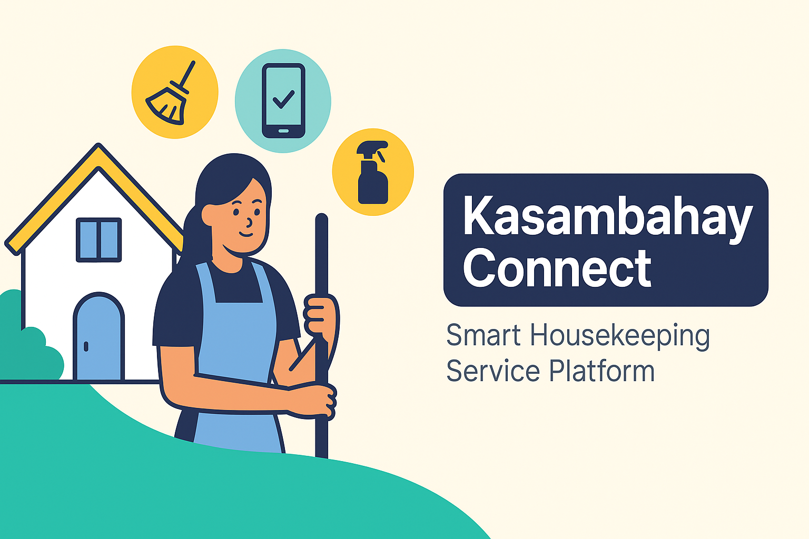

<!-- Banner -->

  

<h1 align="center">🏠 Kasambahay Connect</h1>
<h3 align="center">Smart Housekeeping Service Platform</h3>

  <em>Connecting households with trusted kasambahays through convenience, trust, and innovation.</em>

---

## ✨ About the Project
Kasambahay Connect is a **web and mobile platform** that bridges households and housekeepers.  
It provides families with a safer and faster way to find reliable help, while empowering kasambahays with job opportunities and a reward system.

---

## 🚀 Key Features

| Feature | Description |
|---------|-------------|
| 📋 **Chore Posting** | Post household tasks (cleaning, laundry, cooking, gardening) with schedules and pay rates |
| 👩‍💼 **Housekeeper Profiles** | Kasambahays showcase skills, hourly rate, and availability |
| 🔍 **Two-Way Matching** | Post jobs OR directly book from available kasambahays |
| ⭐ **Ratings & Reviews** | Build trust through verified feedback |
| 💳 **Secure Payments** | Safe and convenient built-in payment gateway |
| 🎟️ **Reward System** | Kasambahays buy points, clients earn tokens for discounts |

---

## 🛠️ Tech Stack  

<h3 align="center">⚙️ Core Technologies</h3>

  

---

## 🌍 Impact
- 💼 Creates **income opportunities** for local kasambahays  
- 🏡 Makes household help **trustworthy and accessible**  
- 🤝 Scales from **individual homes to barangay-level deployments**  

---

## 🗺️ Roadmap
- [ ] Core features: job posting + search/matching  
- [ ] User profiles & verifications  
- [ ] Ratings & reviews system  
- [ ] Secure payment integration  
- [ ] Token & rewards economy  
- [ ] Mobile app deployment  

---

## 📊 Success Metrics

  
  
  

---

## 🏆 Why Kasambahay Connect?
- 🇵🇭 Tailored for **Filipino households**  
- 📅 Flexible booking: per task, hourly, or long-term  
- 🔒 Built-in **trust features**: ratings, verifications, and secure payments  
- 💎 Unique **token-based reward system**  

---

## 🤝 Contributing
We’d love your ideas, feature requests, and collaborations!  
Fork this repo, submit PRs, or open an issue to get started.  

---

## 📬 Contact

  
  

---

💡 <em>Kasambahay Connect – Building trust, one household at a time.</em>

